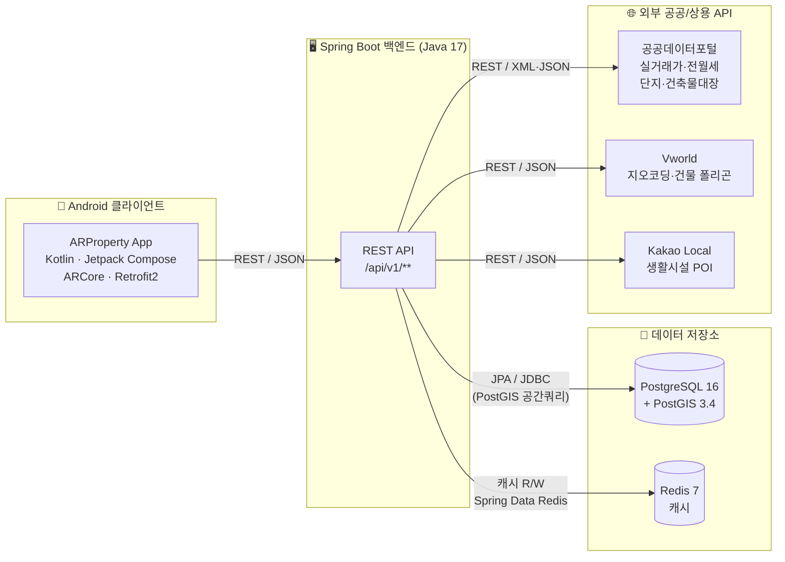
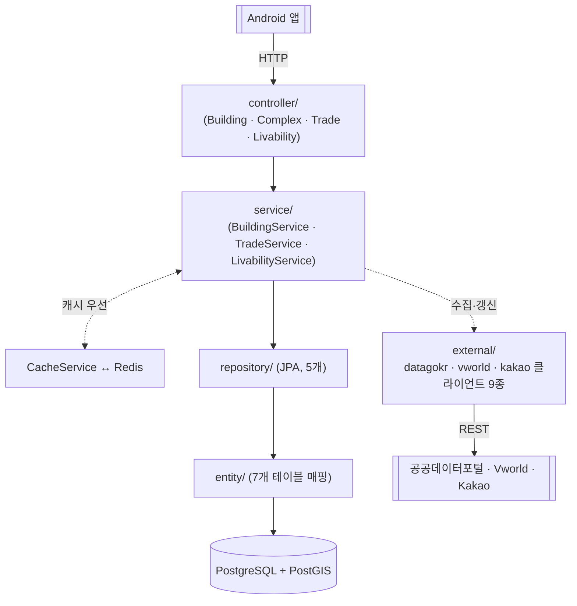
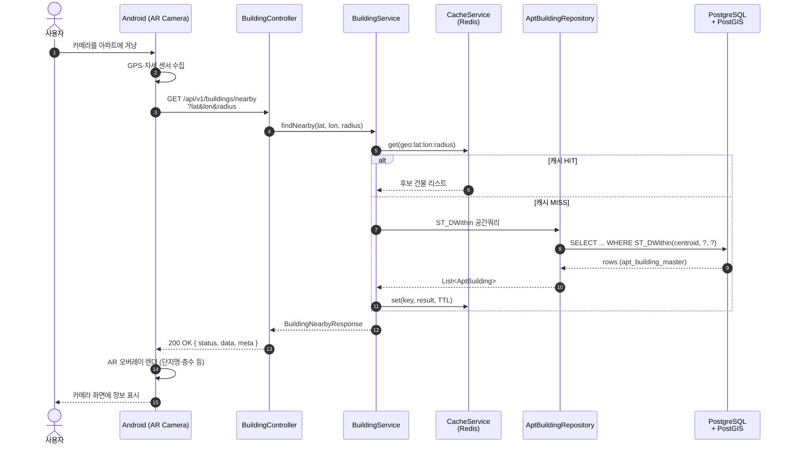
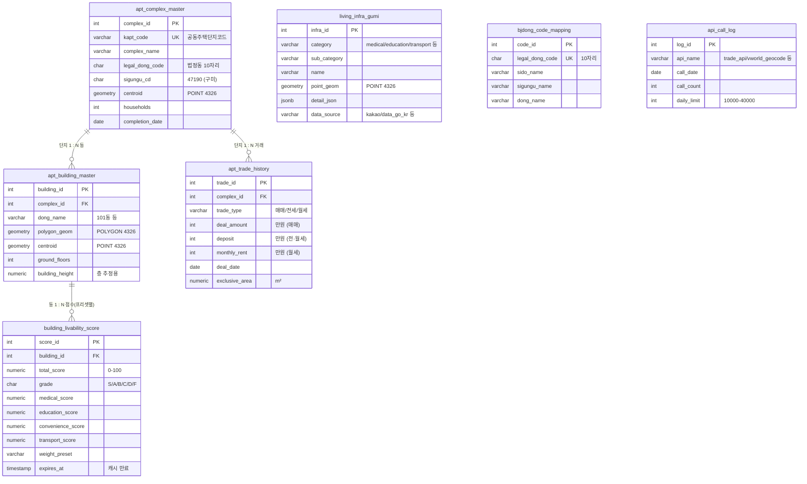

# ARProperty 백엔드 아키텍처

> 대상: 2026-04-21 제안서 발표 슬라이드
> 작성: 백엔드 (엄태원)
> 형식: Mermaid in Markdown — GitHub/VSCode 자동 렌더, 발표용 스크린샷 가능

본 문서는 ARProperty 백엔드의 전체 그림을 4종 다이어그램으로 정리한다. 각 섹션은 다이어그램 + 핵심 노트로 구성되며, 출처는 `CLAUDE.md`, `backend/scripts/init_db.sql`, `docs/api-spec.md`, `backend/src/main/java/com/arproperty/**`에 있는 실제 코드/스키마이다.

---

## 0. 백엔드 한눈에 보기

### 무엇을 하는 서버인가?
구미시 아파트의 **위치·시세·생활 편의 정보**를 모아 Android AR 앱에 제공하는 REST API 서버. 사용자가 카메라를 건물에 겨누면 "이 동네는 살기 좋은가? 시세는 얼마인가?"를 즉시 답할 수 있도록, 외부 공공 데이터를 백엔드가 미리 수집·정제·캐싱해서 단일 API로 노출한다.

### 기술 스택
- **언어/프레임워크**: Java 17 + Spring Boot 3.3.5 (Spring MVC · Spring Data JPA · Spring Data Redis)
- **DB**: PostgreSQL 16 + PostGIS 3.4 (공간 인덱스 · `ST_DWithin` 쿼리)
- **캐시**: Redis 7
- **외부 API**: 공공데이터포털 (실거래가·건축물대장), Vworld (지오코딩·건물 폴리곤), Kakao Local (생활시설 POI)
- **배포**: Docker Compose (db + redis + backend)

### 코드 구조 (5계층)

백엔드 코드를 "식당"에 비유하면 이해가 쉽다. 손님(앱)의 주문(HTTP 요청)이 들어오면 웨이터 → 주방장 → 창고지기 → 재료 순서로 일이 흘러간다.

#### 1. `controller/` — 웨이터 (4개 도메인 + 헬스체크)

**하는 일**: HTTP 요청을 받아서 URL과 파라미터를 해석하고, 알맞은 서비스 메서드를 호출한 다음, 결과를 JSON으로 포장해서 돌려준다. **비즈니스 로직은 여기 없다** — 주문을 받아 주방에 전달하는 웨이터일 뿐.

**예시**: 앱이 `GET /api/v1/buildings/nearby?lat=36.1&lon=128.4&radius=500`을 호출하면
```
BuildingController.nearby(36.1, 128.4, 500)
  → 파라미터 유효성 검사 (범위, 필수값)
  → buildingService.findNearby(36.1, 128.4, 500) 호출
  → 반환받은 결과를 { status, data, meta } 래퍼로 감싸서 응답
```

**우리 프로젝트의 컨트롤러 5개**
- `BuildingController` — 건물 주변 검색/상세
- `ComplexController` — 단지 목록/상세
- `TradeController` — 실거래가 조회
- `LivabilityController` — 생활 편의 점수 조회
- `HealthController` — `GET /health` 하나만. Docker/로드밸런서가 "백엔드 살아있나?" 확인하는 용도

#### 2. `service/` — 주방장 (4개)

**하는 일**: 실제 "생각"이 벌어지는 곳. 주문을 받으면 **"이 요리를 어떻게 만들까?"를 결정**한다 — 캐시에서 꺼낼지(미리 만들어둔 음식), DB에서 재료를 꺼내올지(창고), 외부 API에서 새로 받아올지(시장에 주문), 여러 재료를 합쳐서 가공할지 판단한다.

**예시**: `LivabilityService.calculate(buildingId)` — 특정 동(101동)의 생활 편의 점수를 구할 때
```
1) Redis 캐시에 이미 계산된 점수 있나? (CacheService에 물어봄)
     → 있으면 바로 반환 (끝)
2) 없으면 DB에서 해당 건물 좌표 + 주변 500m 이내 POI(병원·학교 등) 조회
     → LivingInfraRepository 호출
3) 거리별 가중치 적용해서 카테고리별 점수 계산 (의료 80점, 교통 65점 …)
4) 종합 점수 + 등급(S/A/B/C/D/F) 산출
5) 결과를 DB(building_livability_score)와 Redis 양쪽에 저장
6) 반환
```

**우리 프로젝트의 서비스 4개**: `BuildingService`, `TradeService`, `LivabilityService`, `CacheService`(Redis 단일 창구)

#### 3. `repository/` — 창고지기 (5개)

**하는 일**: DB에서 데이터를 꺼내오거나 저장한다. **SQL을 직접 쓰지 않는 게 핵심** — Spring Data JPA가 메서드 이름만 보고 쿼리를 자동으로 만들어준다.

**예시**: `AptBuildingRepository` 인터페이스에 이렇게만 선언하면
```java
List<AptBuilding> findByComplex_ComplexId(Integer complexId);
```
Spring이 자동으로 이런 SQL을 생성해준다
```sql
SELECT * FROM apt_building_master WHERE complex_id = ?
```

**우리 프로젝트의 리포지토리 5개**: `AptComplexRepository`, `AptBuildingRepository`, `AptTradeHistoryRepository`, `LivingInfraRepository`, `BuildingLivabilityScoreRepository` (7개 엔티티 중 자주 쿼리할 5개만 선언)

#### 4. `entity/` — 재료 (7개)

**하는 일**: DB 테이블 1개를 Java 클래스 1개로 매핑한 객체. 테이블의 한 **행(row)** 이 Java 객체 하나가 된다 (ORM — Object-Relational Mapping).

**예시**: `apt_building_master` 테이블의 한 행 ↔ `AptBuilding` 클래스의 인스턴스 하나
```java
@Entity
@Table(name = "apt_building_master")
public class AptBuilding {
    @Id
    @Column(name = "building_id")
    private Integer buildingId;        // ← DB의 building_id 컬럼

    @Column(name = "dong_name")
    private String dongName;           // ← DB의 dong_name 컬럼

    @ManyToOne
    @JoinColumn(name = "complex_id")
    private AptComplex complex;        // ← FK로 연결된 단지 객체
    // ...
}
```
덕분에 서비스 코드는 SQL 없이 `building.getDongName()`, `building.getComplex().getComplexName()` 같은 자바 객체 방식으로 데이터를 다룬다.

**우리 프로젝트의 엔티티 7개**: DB 테이블 7개와 1:1 대응 (`AptComplex`, `AptBuilding`, `AptTradeHistory`, `LivingInfra`, `BuildingLivabilityScore`, `BjdongCodeMapping`, `ApiCallLog`)

#### 5. `external/` — 외부 공급자 담당 (9개 클라이언트)

**하는 일**: 공공데이터포털·Vworld·Kakao 같은 **외부 API를 호출하고 응답을 파싱**한다. 외부 시스템은 XML/JSON이 제각각이고 에러 포맷도 변덕스러운데, 그 지저분함을 이 레이어에만 가둬둔다 → 나머지 코드(service·repository)는 깨끗하게 Java 객체로만 다룰 수 있다.

**출처별로 패키지 분리** (API 키·재시도 정책을 출처별로 한 곳에 모으려고)
```
external/
├── datagokr/    공공데이터포털 (XML 응답)
│   ├── BaseDataGoKrClient          ← 6개 API 공통(인증, XML 파싱, 페이징)
│   ├── TradeApiClient              ← 아파트 매매 실거래가
│   ├── RentApiClient               ← 전·월세
│   ├── AptListApiClient            ← 단지 목록
│   ├── AptInfoApiClient            ← 단지 상세
│   └── BuildingRegisterApiClient   ← 건축물 대장
├── vworld/      국토정보플랫폼 (JSON 응답)
│   ├── GeocoderClient              ← 주소 → 좌표 변환
│   └── BuildingDataClient          ← 건물 폴리곤(건물 외곽선)
└── kakao/       카카오 지도 (JSON 응답)
    └── LocalApiClient              ← 병원·학교·버스정류장 등 POI 검색
```

**예시**: `TradeApiClient.fetch("47190", 2026, 3)`를 호출하면
```
1) 공공데이터포털에 HTTP GET 요청 (API 키 포함)
2) XML 응답 파싱
3) 만원 단위 가격, 계약일 YYYY-MM-DD 등 우리 포맷으로 정제
4) List<AptTradeHistory> 반환
5) 호출 횟수를 api_call_log 테이블에 +1 (일일 한도 관리)
```

---

**흐름 요약**: 앱 → `controller` → `service` → (`repository` → `entity` → DB) 또는 (`external` → 외부 API) → 응답

### DB 테이블 (7개)

| 영문 테이블명 | 한국어 이름 | 역할 |
|---|---|---|
| `apt_complex_master` | 아파트 단지 마스터 | 단지 단위 정보 (단지명·세대수·시공사·중심좌표) |
| `apt_building_master` | 아파트 동 마스터 | 동 단위 정보 (101동 등 · 폴리곤 · 층수) |
| `apt_trade_history` | 거래 이력 | 매매·전세·월세 실거래 기록 |
| `living_infra_gumi` | 구미 생활 인프라 | 병원·학교·버스정류장 등 POI |
| `building_livability_score` | 건물별 편의 점수 캐시 | 6개 카테고리 점수 + 종합등급 (S~F) |
| `bjdong_code_mapping` | 법정동코드 매핑 | 구미 31개 읍·면·동 코드 시드 |
| `api_call_log` | API 호출 로그 | 외부 API 일일 호출 한도 추적 |

핵심 관계: `apt_complex_master` 1 → N `apt_building_master` 1 → N `building_livability_score`, 그리고 `apt_complex_master` 1 → N `apt_trade_history`. 나머지 3개(`living_infra_gumi`, `bjdong_code_mapping`, `api_call_log`)는 독립 테이블.

### 다이어그램 4종 안내
1. **시스템 컨텍스트** — 앱·백엔드·DB·외부 API의 큰 그림
2. **백엔드 내부 레이어** — 코드가 어떤 계층으로 나뉘어 있는지
3. **요청 시퀀스** — AR 탐색 한 번이 처리되는 시간 순서
4. **ER 다이어그램** — 7개 테이블의 관계와 핵심 컬럼

---

## 1. 시스템 컨텍스트

전체 시스템에 어떤 구성요소가 있고, 데이터가 어디서 어디로 흐르는지를 보여주는 가장 큰 그림이다.

**다이어그램 읽는 법**
- **박스 4개 그룹**: 왼쪽부터 ① 사용자 단말(Android), ② 우리가 만드는 백엔드, ③ 데이터 저장소, ④ 외부 데이터 소스
- **화살표 방향 = 누가 누구를 호출하는지**: 항상 "왼쪽이 오른쪽을 부른다". 외부 API는 절대 우리를 먼저 부르지 않는다(폴링 구조 없음)
- **화살표 위 라벨 = 통신 방식**: REST/JSON, JPA/JDBC, Redis 프로토콜 등
- 핵심 메시지: **앱은 백엔드 한 곳만 안다**. 모든 외부 의존성은 백엔드 안쪽에 숨어있다

Android 클라이언트는 백엔드 한 곳만 알고 있고, 외부 데이터 소스(공공데이터포털·Vworld·Kakao Local)는 모두 백엔드가 단독으로 호출한다. 외부 호출 결과와 자체 계산 결과는 Redis에 캐싱하여 일일 호출 한도(`api_call_log.daily_limit`) 압박을 피한다.



**핵심 포인트**
- 앱은 백엔드만 호출 → API 키 노출 차단·CORS 단순화·요금 한도 통합 관리
- PostGIS로 좌표 기반 공간쿼리(`ST_DWithin`)를 직접 처리 → AR 탐색 성능의 핵심
- Redis로 외부 API 호출 결과·계산 결과 캐싱 → 일 한도 회피 + 응답 시간 단축
- 외부 API 호출량은 `api_call_log` 테이블로 일별 카운트·한도 추적

---

## 2. 백엔드 내부 레이어

요청이 들어왔을 때 코드가 어떤 순서로 흐르는지를 5단으로 단순화한 그림. 위에서 아래로 한 방향 흐름이고, `CacheService`만 옆쪽으로 빠진다.



**계층별 역할 한 줄 요약**

| 계층 | 패키지 | 책임 |
|---|---|---|
| Controller | `controller/` | HTTP 라우팅 + 요청 검증 + DTO 변환 |
| Service | `service/` | 비즈니스 로직, 캐시 판단, 외부 API 조율 |
| Cache | `service/CacheService` | Redis 읽기/쓰기 단일 창구 |
| Repository | `repository/` | JPA 인터페이스 (DB 쿼리) |
| Entity | `entity/` | 7개 테이블 ↔ Java 객체 매핑 |
| External | `external/datagokr·vworld·kakao` | 외부 API 호출, XML/JSON 파싱, 재시도 |

**핵심 포인트**
- `service/`가 "캐시 먼저 → 없으면 DB → 그래도 없으면 외부 API"의 우선순위를 결정
- `CacheService`가 캐시 관문 → 도메인 서비스는 Redis API에 직접 의존하지 않음
- `external/`은 출처별 패키지(`datagokr`/`vworld`/`kakao`)로 분리 → API 키·재시도 정책 일원화
- `BaseDataGoKrClient`는 공공데이터포털 6개 API의 XML 파싱·인증·페이징을 공통화

---

## 3. 요청 시퀀스 — AR 탐색 흐름

대표 시나리오: 사용자가 카메라를 건물 쪽으로 겨눠 AR 오버레이가 뜨기까지의 한 사이클. `GET /api/v1/buildings/nearby`가 트리거이며, Redis 히트 시 DB·외부 API 호출을 모두 건너뛴다.



**핵심 포인트**
- 응답 래퍼는 항상 `{ status, data, meta }` 구조 (`docs/api-spec.md` 공통 규칙)
- 캐시 키는 좌표·반경 조합으로 정규화하여 동일 요청 흡수
- 공간쿼리는 `apt_building_master.centroid`의 GIST 인덱스(`idx_building_centroid`)를 탄다
- Phase 2에서 `/api/v1/buildings/{id}` 상세·`/api/v1/buildings/{id}/trades`로 드릴다운

---

## 4. ER 다이어그램 (7개 테이블)

3개 핵심 도메인 테이블이 FK로 묶여 있고, 나머지 4개는 인프라/메타 정보로 독립적으로 운영된다. 각 테이블의 한국어 이름은 §0 「DB 테이블」 표를 참고.



**핵심 포인트**
- 도메인 핵심: `apt_complex_master`(단지) → `apt_building_master`(동) → `building_livability_score`(편의 점수 캐시)
- 모든 좌표는 EPSG:4326(WGS84), GIST 인덱스로 공간쿼리 가속
- `building_livability_score`는 `weight_preset`별로 결과 캐싱(`expires_at` 만료 관리)
- `api_call_log`로 외부 API 일일 호출 한도(공공데이터 1만, Vworld 4만, Kakao 3만) 통제
- `bjdong_code_mapping`에 구미시 31개 읍·면·동 법정동코드 시드 데이터 보유

---

## 5. 데이터베이스 스키마 상세

ER 다이어그램에는 핵심 컬럼만 표시했지만, 실제 스키마는 컬럼 60여 개 + GIST/B-Tree 인덱스 22개로 구성된다. 출처는 `backend/scripts/init_db.sql`. 모든 타입은 PostgreSQL 16 + PostGIS 3.4 기준이다.

> 7개 테이블 한국어/영문 매핑 빠른 참조
> ① `apt_complex_master` (아파트 단지 마스터) ② `apt_building_master` (아파트 동 마스터) ③ `apt_trade_history` (거래 이력) ④ `living_infra_gumi` (구미 생활 인프라) ⑤ `building_livability_score` (건물별 편의 점수 캐시) ⑥ `bjdong_code_mapping` (법정동코드 매핑) ⑦ `api_call_log` (API 호출 로그)

### 5.1 `apt_complex_master` — 아파트 단지 마스터

| 컬럼 | 타입 | 제약 | 설명 |
|---|---|---|---|
| `complex_id` | SERIAL | **PK** | 단지 PK |
| `kapt_code` | VARCHAR(20) | UNIQUE | 공동주택단지코드 (공공데이터포털 키) |
| `reb_complex_id` | VARCHAR(20) | | 한국부동산원 단지고유번호 |
| `complex_name` | VARCHAR(100) | NOT NULL | 단지명 |
| `legal_dong_code` | CHAR(10) | NOT NULL | 법정동코드 10자리 |
| `sigungu_cd` | CHAR(5) | NOT NULL, DEFAULT '47190' | 시군구코드 (구미 고정) |
| `bjdong_cd` | CHAR(5) | NOT NULL | 법정동코드 뒤 5자리 |
| `road_address` / `parcel_address` | VARCHAR(200) | | 도로명·지번 주소 |
| `households` | INTEGER | | 총 세대수 |
| `building_count` | INTEGER | | 동 수 |
| `completion_date` | DATE | | 사용승인일/준공일 |
| `constructor` | VARCHAR(100) | | 시공사 |
| `heating_type` / `management_type` | VARCHAR(50) | | 난방·관리 방식 |
| `parking_count` / `elevator_count` | INTEGER | | 주차·승강기 대수 |
| `centroid` | GEOMETRY(POINT, 4326) | | 단지 중심 좌표 (WGS84) |
| `created_at` / `updated_at` | TIMESTAMP | DEFAULT NOW | 감사 |

**인덱스**: `kapt_code`, `legal_dong_code`, `sigungu_cd`, `complex_name` (B-Tree) · `centroid` (GIST)

### 5.2 `apt_building_master` — 아파트 동 마스터

| 컬럼 | 타입 | 제약 | 설명 |
|---|---|---|---|
| `building_id` | SERIAL | **PK** | 동 PK |
| `complex_id` | INTEGER | **FK** → `apt_complex_master`, ON DELETE CASCADE | 소속 단지 |
| `dong_name` | VARCHAR(50) | NOT NULL | 동명 (101동, 102동…) |
| `polygon_geom` | GEOMETRY(POLYGON, 4326) | | 건물 폴리곤 (Vworld) |
| `centroid` | GEOMETRY(POINT, 4326) | | 건물 중심 좌표 |
| `ground_floors` | INTEGER | | 지상 층수 |
| `underground_floors` | INTEGER | DEFAULT 0 | 지하 층수 |
| `highest_floor` | INTEGER | | 최고층 |
| `building_height` | NUMERIC(8,2) | | 건물 높이(m) — AR 층 추정용 |
| `structure_type` | VARCHAR(50) | | 구조 (RC, SRC 등) |
| `total_area` | NUMERIC(12,2) | | 연면적(m²) |
| `use_approval_date` | DATE | | 사용승인일 |
| `created_at` / `updated_at` | TIMESTAMP | DEFAULT NOW | 감사 |

**제약**: `UNIQUE(complex_id, dong_name)` — 한 단지 내 동명 중복 금지
**인덱스**: `complex_id`, `dong_name` (B-Tree) · `polygon_geom`, `centroid` (GIST)

### 5.3 `apt_trade_history` — 매매·전세·월세 거래 이력

| 컬럼 | 타입 | 제약 | 설명 |
|---|---|---|---|
| `trade_id` | SERIAL | **PK** | 거래 PK |
| `complex_id` | INTEGER | **FK** → `apt_complex_master`, ON DELETE CASCADE | 거래 단지 |
| `dong_name` | VARCHAR(50) | | 동명 |
| `floor` | INTEGER | | 층 |
| `exclusive_area` | NUMERIC(8,2) | | 전용면적(m²) |
| `deal_amount` | INTEGER | | 거래금액(만원) — 매매 |
| `deposit` | INTEGER | | 보증금(만원) — 전·월세 |
| `monthly_rent` | INTEGER | | 월세(만원) — 월세 |
| `deal_date` | DATE | NOT NULL | 계약일 |
| `deal_year` / `deal_month` | INTEGER | NOT NULL | 계약년·월 (집계용) |
| `trade_type` | VARCHAR(10) | NOT NULL, CHECK IN ('매매','전세','월세') | 거래 유형 |
| `building_year` | INTEGER | | 건축년도 |
| `jibun` | VARCHAR(20) | | 지번 |
| `apt_name` | VARCHAR(100) | | API 응답 단지명 (원본 보존) |
| `dealing_type` | VARCHAR(20) | | 중개/직거래 |
| `created_at` | TIMESTAMP | DEFAULT NOW | 감사 |

**인덱스**: `complex_id`, `deal_date DESC`, `trade_type`, `(complex_id, dong_name, floor)`, `exclusive_area`, `(deal_year, deal_month)` (모두 B-Tree)

### 5.4 `living_infra_gumi` — 구미시 생활 인프라 POI

| 컬럼 | 타입 | 제약 | 설명 |
|---|---|---|---|
| `infra_id` | SERIAL | **PK** | POI PK |
| `category` | VARCHAR(20) | NOT NULL, CHECK | `medical`/`education`/`convenience`/`transport`/`safety`/`leisure` |
| `sub_category` | VARCHAR(50) | NOT NULL | 소분류 (`hospital`, `pharmacy`, `bus_stop` 등) |
| `name` | VARCHAR(200) | NOT NULL | 시설명 |
| `point_geom` | GEOMETRY(POINT, 4326) | NOT NULL | 좌표 |
| `address` | VARCHAR(300) | | 주소 |
| `detail_json` | JSONB | | 부가 정보 (운영시간, 전화번호 등) |
| `data_source` | VARCHAR(50) | NOT NULL, CHECK | `kakao`/`gumi_opendata`/`data_go_kr`/`manual` |
| `created_at` / `updated_at` | TIMESTAMP | DEFAULT NOW | 감사 |

**인덱스**: `point_geom` (GIST) · `category`, `sub_category`, `data_source` (B-Tree)

### 5.5 `building_livability_score` — 건물별 생활 편의 점수 캐시

| 컬럼 | 타입 | 제약 | 설명 |
|---|---|---|---|
| `score_id` | SERIAL | **PK** | 점수 PK |
| `building_id` | INTEGER | **FK** → `apt_building_master`, ON DELETE CASCADE | 대상 동 |
| `total_score` | NUMERIC(5,1) | NOT NULL | 종합 점수 (0~100) |
| `grade` | CHAR(1) | NOT NULL, CHECK IN ('S','A','B','C','D','F') | 등급 |
| `medical_score` | NUMERIC(5,1) | DEFAULT 0 | 의료 점수 |
| `education_score` | NUMERIC(5,1) | DEFAULT 0 | 교육 점수 |
| `convenience_score` | NUMERIC(5,1) | DEFAULT 0 | 생활편의 점수 |
| `transport_score` | NUMERIC(5,1) | DEFAULT 0 | 교통 점수 |
| `safety_score` | NUMERIC(5,1) | DEFAULT 0 | 안전 점수 |
| `leisure_score` | NUMERIC(5,1) | DEFAULT 0 | 여가 점수 |
| `weight_preset` | VARCHAR(20) | DEFAULT 'default' | 가중치 프리셋 (가족/투자/학생 등) |
| `nearest_json` | JSONB | | 카테고리별 최근접 시설 상세 |
| `calculated_at` | TIMESTAMP | NOT NULL, DEFAULT NOW | 계산 시점 |
| `expires_at` | TIMESTAMP | NOT NULL | 캐시 만료 시점 |

**제약**: `UNIQUE(building_id, weight_preset)` — 동·프리셋당 1행
**인덱스**: `building_id`, `expires_at`, `grade` (B-Tree)

### 5.6 `bjdong_code_mapping` — 법정동코드 매핑

| 컬럼 | 타입 | 제약 | 설명 |
|---|---|---|---|
| `code_id` | SERIAL | **PK** | 매핑 PK |
| `legal_dong_code` | CHAR(10) | UNIQUE NOT NULL | 법정동코드 10자리 |
| `sido_name` | VARCHAR(20) | NOT NULL | 시도명 |
| `sigungu_name` | VARCHAR(20) | NOT NULL | 시군구명 |
| `dong_name` | VARCHAR(30) | NOT NULL | 읍·면·동명 |
| `is_active` | BOOLEAN | DEFAULT TRUE | 활성 여부 |
| `created_at` | TIMESTAMP | DEFAULT NOW | 감사 |

**인덱스**: `legal_dong_code` (B-Tree)
**시드 데이터**: 구미시 31개 읍·면·동 (원평동~고아읍) — `4719010100` ~ `4719031000`

### 5.7 `api_call_log` — 외부 API 호출 로그/한도 관리

| 컬럼 | 타입 | 제약 | 설명 |
|---|---|---|---|
| `log_id` | SERIAL | **PK** | 로그 PK |
| `api_name` | VARCHAR(50) | NOT NULL | API 식별자 (아래 시드 참조) |
| `call_date` | DATE | NOT NULL, DEFAULT CURRENT_DATE | 호출 일자 |
| `call_count` | INTEGER | DEFAULT 0 | 누적 호출 수 |
| `daily_limit` | INTEGER | NOT NULL | 일일 한도 |

**제약**: `UNIQUE(api_name, call_date)` — UPSERT로 카운트 누적
**인덱스**: `(api_name, call_date)` (B-Tree)

**시드 데이터 (일일 한도)**

| `api_name` | 한도 | 출처 |
|---|---:|---|
| `trade_api` | 10,000 | 공공데이터포털 - 아파트 매매 실거래가 |
| `rent_api` | 10,000 | 공공데이터포털 - 아파트 전·월세 |
| `building_register` | 10,000 | 공공데이터포털 - 건축물대장 |
| `apt_list` | 10,000 | 공공데이터포털 - 공동주택 단지 목록 |
| `apt_info` | 10,000 | 공공데이터포털 - 공동주택 상세정보 |
| `vworld_geocode` | 40,000 | Vworld - 지오코딩 |
| `vworld_data` | 40,000 | Vworld - 건물 폴리곤 |
| `kakao_local` | 30,000 | Kakao Local - POI |

### 5.8 PostGIS / 확장 기능

- `CREATE EXTENSION IF NOT EXISTS postgis;` — `init_db.sql` 최상단에서 활성화
- 좌표계 통일: **EPSG:4326** (WGS84, 위경도) — Android GPS·Vworld·Kakao 모두 호환
- 공간쿼리 패턴:
  - 주변 검색: `ST_DWithin(centroid::geography, ST_MakePoint(?, ?)::geography, ?)` — 반경(m) 단위
  - 폴리곤 포함: `ST_Contains(polygon_geom, ST_MakePoint(?, ?))` — 카메라 가리킨 지점이 어느 동인지 판정
- 모든 지오메트리 컬럼에 **GIST 인덱스** 적용 → 수만 건 규모에서도 ms 단위 응답
